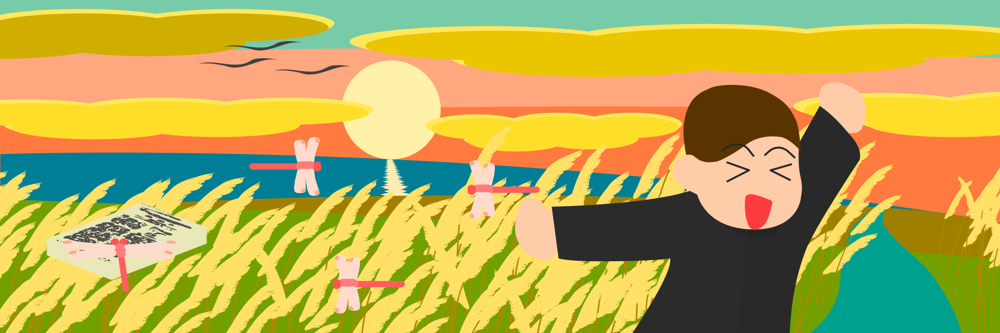

yantene's icons
=============

yantene が使用しているアイコンです。

特段ライセンスの設定などはしませんが、
yantene を表す画像として使用する限り、
良識の範囲内で使用することができます。

[Releases](https://github.com/yantene/icons/releases/latest)
よりダウンロードしてください。

## 画像一覧

### Simplified

現在メインで使用しているアイコンです。
シンプルで視認性が高いのが特徴です。

正方形または真円でトリミングして使うことを想定しています。

### Pastel

Simplified をベースにパーカを着せて全身を構成しました。

顔部分にフォーカスを当てて小さめのアイコンに使いやすい `pastel-icon`、
全身を含めた `pastel`、
そして横長のヘッダ画像に使いやすい `pastel-header` を含めています。

### Winter

少し前まで使用していたアイコンです。
ヘッダ画像で使用できるよう、横長になっています。

また、Releases には顔の部分を抜き出したバージョンも含めています。

### Autumn

秋の景色のアイコンです。

Releases には顔の部分を抜き出したバージョンも含めています。

### Summer

夏の景色のアイコンです。

Releases には顔の部分を抜き出したバージョンも含めています。
